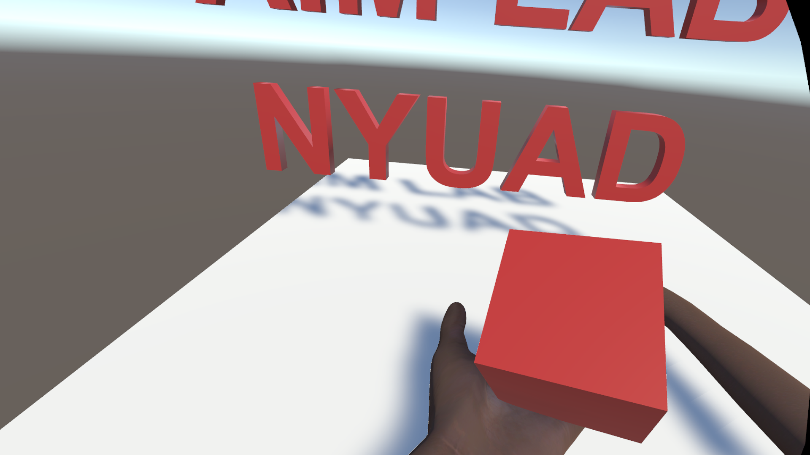

# Oculus-Ultraleap-Hand-Template


[](https://forthebadge.com)
[](https://forthebadge.com)

VR Hand Tracking Template in Oculus Quest 2 using Leap Motion with Serial Communication Support.


This tool has been developed by [ Applied Interactive Multimedia (AIM) research group](https://www.aimlab-haptics.com/) at New York University Abu Dhabi, for internal use within the Lab.



## Installation

Before starting, please download Unity Editor `2020.3.25f1` using Unity Hub. Then, install the Windows Build Support. Then, download Git from [this link](https://git-scm.com/download/win).

Then clone this repository by typing the following in command prompt.

```
git clone https://github.com/Pi-31415/Oculus-Ultraleap-Hand-Template.git
```

Once cloning is done, you can open Unity Hub, click `Open -> Add Project from Disk` and select the cloned folder.

Everything is configured, and there is no need to import additional packages. To begin using, please duplicate the `RiggedHands` Unity Scene and begin modifying to suit your needs.

Once you have designed the game, build it for Windows and open the application in Occulus Link Software, then connect the headset to the computer.

## Contact

Please contact <pk2269@nyu.edu> for any issues regarding this template.
